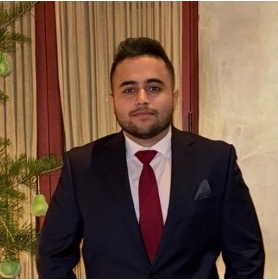
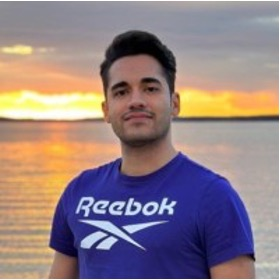



Our research group, the <b>Jayhawk Data Science Lab (JDSL)</b>, is interested in developing personalized, transparent, and trustworthy machine learning frameworks for real-world decision-support systems for the good of humans.





## Members
### Ph.D. Students

    

        
        

          Arya Hadizadeh Moghaddam 
          Computer Science 
          2022 - present (<a href="../files/AryaHM_CV.pdf" target="_blank">link</a>)
        

    

    

        
        

          Mohsen Nayebi Kerdabadi 
          Computer Science 
          2023 - present (<a href="https://mohsen-nyb.github.io/" target="_blank">link</a>)
        

    

### Master's Students
- Israel Herrera Rivera, Chemical Engineering, 2023 - present (co-chair with Dr. Xiaoli Li)
  - Fulbright Student
  - Thesis: Leveraging Graph-Based Artificial Intelligence for Molecular Structure Screening

### Undergraduate Students
- Shad Ahmed Shahul Hameed, Computer Science, 2023 - present
  - Undergraduate Research Awards (UGRA)
  - Topic: Discovering Novel Promoters for Hydrogen Hydrate Formation through Artificial Intelligence
- Pranav Amatapu, Computer Science, (2024 - present)
  - Topic: Harnessing Zero- and Few-Shot Predictive Capabilities of LLMs in Healthcare Analytics

  
### Alumni
- Amith Pramod Panuganti, BS, Computer Science, 2022 - 2024
-	Mohammmed Atif Siddiqui, MS, Computer Science (project option), 2022 - 2024
- Abhishek Doodgaon, MS, Computer Science (thesis option), graduated 2024 (co-chair with Dr. Jian Li)
-	Archana Chalicheemala, MS, Computer Science (project option), graduated 2023
-	Yoganand Pitta, MS, Computer Science (project option), graduated 2023
-	Ishrak Hayet, MS, Computer Science (thesis option), graduated 2022 (co-chair with Dr. Bo Luo)

