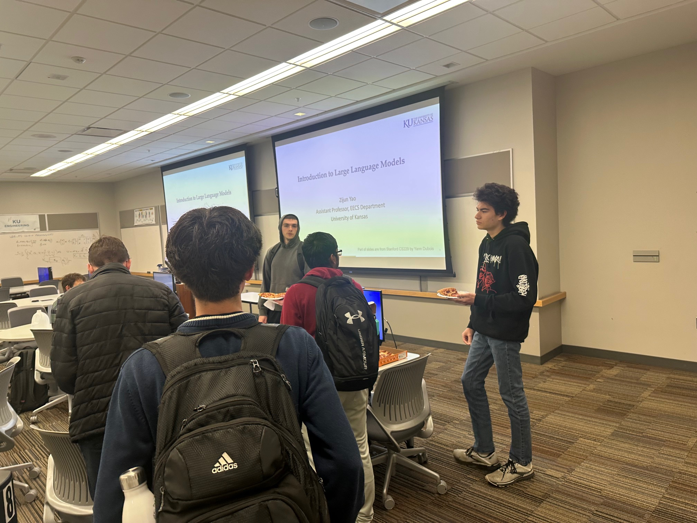
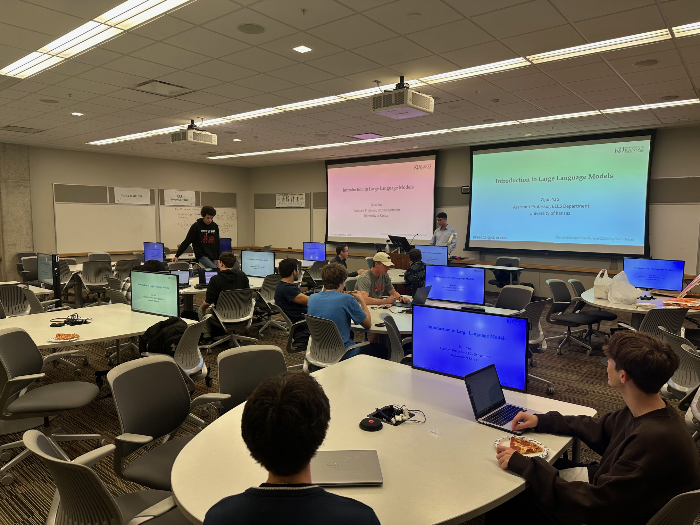



Actively encouraging a broader audience to be involved in research is a powerful way to foster inclusivity, innovation, and academic growth. I aim to help students from diverse backgrounds build confidence, develop critical skills, and contribute fresh perspectives to scholarly work. These outreach activities not only enriches the students' educational journey but also strengthens the KU academic community by embracing the full spectrum of talent and ideas.





- Mentor at KU Emerging Scholar Program, Fall 2024
  - Goal: Providing research experiences for low-income students in their first year at KU and supports their overall transition to college. ([link](https://curf.ku.edu/emerging-scholars))
  - Topic: Harnessing Zero- and Few-Shot Predictive Capabilities of LLMs in Healthcare Analytics
  
- Guest Speaker at KU AI Club, October & November 2024
  - Topic: Introduction to Large Language Model

- Guest Speaker at KU's student chapter of the Association for Computing Machinery (ACM), March 2023
  - Topic: Data Science in Real Life: Enabling Smarter, Faster, and More Informed Decisions

    

        
        

          Talks at KU AI Club (1)
        

    

    

        
        

          Talks at KU AI Club (2)
        

    

